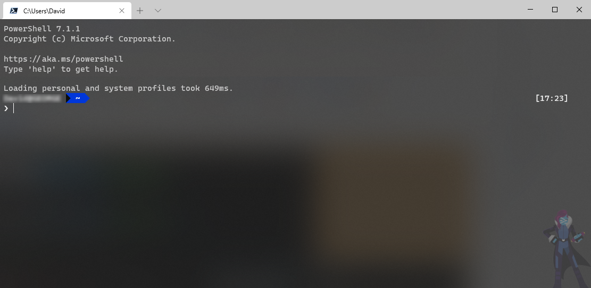

# Windows Terminal Setup

## Acrylic Styling (semi transparent)


```json
"profiles": [
    {
        ...
        "useAcrylic": true,
        "acrylicOpacity": 0.75,
        ...
    }
]
```

<br>

## Images
Images are located in the `/images` folder

### Image configurations 

```json
"profiles": [
    {
        ...
        "backgroundImage": "%USERPROFILE%/source/repos/windows-terminal-setup/images/pwsh_hero.png",
        "backgroundImageAlignment": "bottomRight",
        "backgroundImageStretchMode": "none",
        "backgroundImageOpacity": 0.34
    },
]
```
(assuming your repo is located under `%USERPROFILE%/source/repos/`)

<br>

## Setting up WSL
```json
{
    "guid": "{07b52e3e-de2c-5db4-bd2d-ba144ed6c273}",
    "hidden": false,
    "name": "Ubuntu-20.04",
    "source": "Windows.Terminal.Wsl",
    "fontFace": "Cascadia Code PL",
    "useAcrylic": true,
    "acrylicOpacity": 0.85,
    "startingDirectory": "\\\\wsl$\\Ubuntu-20.04\\home\\dave",
},
```
To make it easy to get this path you can run the following command from your distro. This will convert the WSL `HOME` folder path to `\\wsl$\...` form, escape the backslashes and then pop the result on the clipboard ready for you to paste into your.
```
wslpath -w ~ | sed 's/\\/\\\\/g' | clip.exe
```
<br>

## Powerline Setup
> Using Oh my Posh v3 ([https://ohmyposh.dev/](https://ohmyposh.dev/))
### Powershell

Using PowerShell, install Oh my Posh.
```powershell
Install-Module oh-my-posh -Scope CurrentUser -AllowPrerelease
```
<br>

Open your PowerShell profile with `notepad $PROFILE` or the text editor of your choice. 

In your PowerShell profile, add the following to the end of the file:
```powershell
Set-PoshPrompt -Theme PowerLine
```
Save and close it

Set Cascadia Code PL as your font
```json
"profiles": [
    {
        ...
        "name": "PowerShell Core",
        "source": "Windows.Terminal.PowershellCore",
        "fontFace": "Cascadia Code PL",
        ...
    }
]
```
Reload the profile
```
. $profile
```

### WSL Ubuntu

Install oh-my-posh:
```bash
sudo wget https://github.com/JanDeDobbeleer/oh-my-posh/releases/latest/download/posh-linux-amd64 -O /usr/local/bin/oh-my-posh
sudo chmod +x /usr/local/bin/oh-my-posh
```
> If you get any SSL errors you can add the following `–no-check-certificate` to the wget call

Get themes
```bash
mkdir ~/.poshthemes
wget https://github.com/JanDeDobbeleer/oh-my-posh/releases/latest/download/themes.zip -O ~/.poshthemes/themes.zip
unzip ~/.poshthemes/themes.zip -d ~/.poshthemes
chmod u+rw ~/.poshthemes/*.json
rm ~/.poshthemes/themes.zip
```

You might need to install `unzip`: 
```bash
sudo apt install unzip
```
Add the following line to the bottom of your `~/.bashrc`

```bash
eval "$(oh-my-posh --init --shell bash --config ~/.poshthemes/powerline.omp.json)"
```

Set Cascadia Code PL as your font
```json
"profiles": [
    {
        ...
        "name": "PowerShell Core",
        "source": "Windows.Terminal.PowershellCore",
        "fontFace": "Cascadia Code PL",
        ...
    }
]
```
Restart the terminal

<br>

## Default profile
If you have a bunch of common settings you can leverage the `defaults` node to set them in one place.
```json
{
    "defaults":{
        "useAcrylic": true,
        "acrylicOpacity": 0.75,
        "backgroundImageAlignment": "bottomRight",
        "backgroundImageStretchMode": "none",
        "backgroundImageOpacity": 0.34
    }
}
```

<br>
<br>

***
## References
* Tutorial: Set up Powerline in Windows Terminal
    * https://docs.microsoft.com/en-us/windows/terminal/tutorials/powerline-setup
* Oh my Posh Themes
    * https://ohmyposh.dev/docs/themes/
* Set Windows Terminal to use your user HOME directory
    * https://wsl.tips/tips/windows-terminal-start-directory/
* Windows Terminal Docs
    * https://docs.microsoft.com/en-us/windows/terminal/